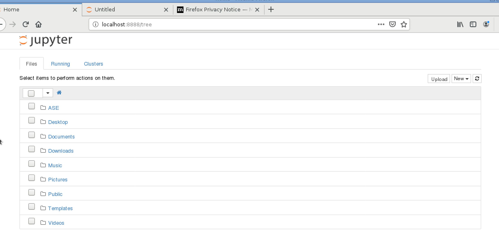

# Jupyter notebookの使用

## Jupyter Notebookとは
MathematicaやMatLabのような操作感でPythonを実行できるものです。
具体的に試してみましょう。以下はMateriAppsLiveの2.5で試しました。

## 準備：ASEのインストール。
まず、Pythonの準備をします。以下のコマンドをターミナルで打ち込んでください。

```
sudo curl -kL https://bootstrap.pypa.io/get-pip.py | sudo python3
```
パスワードを聞かれますが、これはlive
と打ち込んでください。
次に、

```
sudo python3 -m pip install --upgrade --user ase
```
と入れてください。

## Jupyter notebookの操作

### Jupyter Notebookの起動
ターミナルで、

```
jupyter notebook
```
と打ちます。
すると、Webブラウザが立ち上がります。

 

### フォルダの作成
まず、フォルダを作成します。
右上の「new」を押して、「Folder」を押すと、フォルダが作成されます。
よく見ると「Untitled Folder」があると思います。
その左のチェックボックスを押すと、Renameボタンが出てきて名前を変更できるようになりますので、
Renameボタンを押して、「ASE」という名前にしてみましょう。
できたASEフォルダをクリックします。

### Pythonノートブックの起動
次に、Pythonノートブックを起動してみましょう。
右上の「New」を押し、「Python 3」を選びます。
すると、以下のような画面になります。

 

この中のInの部分にPythonでプログラムを書くことができます。
この図の中では、

```
a = 3
b = 5
a+b
```
とありますが、これは、計算をしていることになります。
計算するには、Mathematicaと同じで、「Shift」キー+「Enter」キーでできます。

あとはPythonの入門書でもサイトでも見ながら好きなようにやってみてもよいでしょう。


## 動作確認
次に、ASEがちゃんと動いているか確認するため、以下のサンプルコードを打ち込んでみましょう。

```
from ase import Atoms
from ase.calculators.emt import EMT
from ase.constraints import FixAtoms
from ase.optimize import QuasiNewton
from ase.build import fcc111, add_adsorbate

h = 1.85
d = 1.10

slab = fcc111('Cu', size=(4, 4, 2), vacuum=10.0) #銅原子スラブのセット

slab.set_calculator(EMT()) #銅原子スラブの計算にはEMTを使用
e_slab = slab.get_potential_energy() #スラブのポテンシャルエネルギーを計算

molecule = Atoms('2N', positions=[(0., 0., 0.), (0., 0., d)]) #窒素分子のセット。(0,0,0)が一つ目のNの位置、(0,0,d)が二つ目のNの位置。
molecule.set_calculator(EMT()) #窒素分子の計算にはEMTを使用
e_N2 = molecule.get_potential_energy() #窒素分子のポテンシャルエネルギーの計算

add_adsorbate(slab, molecule, h, 'ontop') #窒素分子を上にのせる
constraint = FixAtoms(mask=[a.symbol != 'N' for a in slab]) #拘束条件としては、計算を高速化するため、銅原子の位置を緩和させずに固定
slab.set_constraint(constraint) #拘束条件をセット
dyn = QuasiNewton(slab, trajectory='N2Cu.traj') #準ニュートン法を設定
dyn.run(fmax=0.05) #構造緩和スタート。全ての原子に働く力がfmax以下になるまで。

print('Adsorption energy:', e_slab + e_N2 - slab.get_potential_energy()) #ポテンシャルエネルギーを計算し、先ほどの二つとの差を取る
```
これでshift+enterキーを押します。

```
                Step[ FC]     Time          Energy          fmax
*Force-consistent energies used in optimization.
BFGSLineSearch:    0[  0] 20:36:51       11.689927*       1.0797
BFGSLineSearch:    1[  2] 20:36:51       11.670814*       0.4090
BFGSLineSearch:    2[  4] 20:36:51       11.625880*       0.0409
Adsorption energy: 0.3235194223181139
```
のように出れば成功です。
第一原理計算ではありませんが、上のコードで
NaCl結晶の格子定数を求めたことになります。


