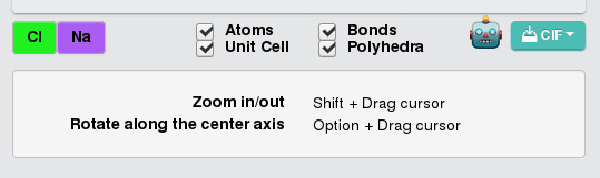

# 第一原理計算高速チュートリアル
一つ一つは見ていくのは面倒！という人のために、このページにあることを実行すれば第一原理計算ができるようにしました。
順番にやってみてください。固体の第一原理計算をQuantum Espressoで実行することを念頭においています。
ここに書いたことはあとで項別にまとめる予定です。

## 質問について
こちらの記事に関する質問は
https://github.com/cometscome/DFT/issues
にしていただけるとスムーズに回答できると思います。

## 最初に行うこと
[MateriApps LIVE!のインストール](@ref)
をみて、MateriApps LIVE!のインストールを終わらせてください。

## ASEのインストール
左下のツバメみたいなアイコンをクリックして、System ToolsからLXTerminalを選んでターミナルを出し、
以下のものを打ち込んでください。これは全て仮想マシン上で行われていますので、お使いのPCへの影響は全くありませんので安心してください。

### MateriApps 2.5以前
```
sudo curl -kL https://bootstrap.pypa.io/get-pip.py | sudo python3
```
パスワードを聞かれますが、これはlive
と打ち込んでください。
次に、

```
python3 -m pip install --upgrade --user ase
```
と入れてください。

### 3以降
MateriApps 3.0以降の場合には、上記の2行ではなく、
```sh
pip3 install --upgrade --user ase
```
でASEをインストールすることができます。

### Jupyter Notebook

次に
[Jupyter Notebookの起動](@ref)
をみてJupyter notebookを起動してください。

## 結晶構造の入手
左下のツバメメニューからWebブラウザFirefoxを起動し、Materials Project
URL:https://materialsproject.org/
に移動してください。
ここには様々な固体の情報がデータベース化されています。
無料で利用できますので、googleアカウントをお持ちであれば簡単にログインできます。

### NaClの構造の入手
さて、NaClの構造を入手してみましょう。
周期表の表示があるので、そこでNaをクリックするか、あるいは検索窓にNa-Clなどと入れれば見つけることができます。
NaClのどれかをクリックして表示させます。
ここで、



のCIFをクリックし、「Computed」を選んでみましょう。
これでDownloadsディレクトリにファイルがダウンロードされました。

### Vestaによる結晶構造の確認
次に、ターミナルに戻ります。
ここで、

```
 cd ~/Downloads/
```
でDownloadsディレクトリに移動すると、ファイルがあるのがわかると思います。
そして、

```
vesta NaCl_mp-22862_computed.cif
```
とすればVESTAが立ち上がり、結晶構造を見ることができます。
VESTAは非常に優秀な「結晶構造、電子・核密度等の三次元データ、及び結晶外形の可視化プログラム」です。
https://jp-minerals.org/vesta/jp/

## ASEでの第一原理計算

### ASEでの取り込み
保存したファイルをjupyter notebookでASEを使って取り扱ってみましょう。
保存したファイルは

```
cp ~/Downloads/NaCl_mp-22862_computed.cif ~/ASE/
```
で作ったフォルダにコピーしておきましょう。
あとは

```
import ase.io 
rocksalt =ase.io.read("NaCl_mp-22862_computed.cif")
```
すれば読み込むことができます。

### 第一原理計算のテスト実行

このあとは、

[NaCl結晶の格子定数](@ref)
のようにやればよいです。

具体的には、ターミナルでまず

擬ポテンシャルのダウンロード：

```bash
cd /usr/share/espresso/pseudo
sudo wget https://www.quantum-espresso.org/upf_files/Na.pbesol-spn-kjpaw_psl.1.0.0.UPF
sudo wget https://www.quantum-espresso.org/upf_files/Cl.pbesol-n-kjpaw_psl.1.0.0.UPF
```
NaとClの擬ポテンシャルをダウンロードします。なお、他の擬ポテンシャルは
https://www.quantum-espresso.org/pseudopotentials
にあります。


次に、Jupyter notebook上で

```python
from ase.build import bulk
from ase.calculators.espresso import Espresso
from ase.constraints import UnitCellFilter
from ase.optimize import LBFGS
import ase.io 

#pseudopotentials = {'Na': 'Na.pbe-spn-kjpaw_psl.1.0.0.UPF',
#                    'Cl': 'Cl.pbe-n-rrkjus_psl.1.0.0.UPF'} #擬ポテンシャルの種類が違うの修正
pseudopotentials = {'Na': 'Na.pbesol-spn-kjpaw_psl.1.0.0.UPF',
                    'Cl': 'Cl.pbesol-n-kjpaw_psl.1.0.0.UPF'}
#rocksalt = bulk('NaCl', crystalstructure='rocksalt', a=6.0)
rocksalt =ase.io.read("NaCl_mp-22862_computed.cif") #Material Projectでダウンロードしたものを使う場合。
calc = Espresso(pseudopotentials=pseudopotentials,
                tstress=True, tprnfor=True, kpts=(3, 3, 3))

rocksalt.set_calculator(calc)

ucf = UnitCellFilter(rocksalt)
opt = LBFGS(ucf)
opt.run(fmax=0.005)

# cubic lattic constant
print((8*rocksalt.get_volume()/len(rocksalt))**(1.0/3.0))
```

コードでは、格子定数を最初は6として、設定したあと、構造最適化をしています。最後に、構造最適化して出てきた格子定数をプリントしています。

これを実行すると、
```
       Step     Time          Energy         fmax
LBFGS:    0 21:27:48    -1960.836397        0.0625
LBFGS:    1 21:28:01    -1960.836540        0.0501
LBFGS:    2 21:28:13    -1960.834692        0.0338
LBFGS:    3 21:28:26    -1960.833702        0.0079
LBFGS:    4 21:28:39    -1960.834037        0.0006
5.661404166984403
```
と出ます。
これで第一原理計算でNaClの構造最適化ができました。

## 第一原理計算のテスト
### Siのバンド構造
Siのバンド計算をやってみましょう。
まず、バルクのSiを用意し、計算としてQuantum Espressoを使うことにします。

```python
from ase.build import bulk
from ase.calculators.espresso import Espresso
atoms = bulk("Si") #バルクのSiの用意
pseudopotentials = {'Si':'Si.pz-vbc.UPF'} #擬ポテンシャルの設定


input_data = {
    'system': {
        'ecutwfc': 64,
        'ecutrho': 576,
        'nbnd' : 12 },
    'disk_io': 'low'}  #Quantum Espressoのパラメータ

calc = Espresso(pseudopotentials=pseudopotentials,kpts=(4, 4, 4),input_data=input_data)
atoms.set_calculator(calc)
```
Quantum Espressoのパラメータを```input_data```で入れることができます。
詳しくは
[quantum ESPRESSO tutorial](http://www.stat.phys.titech.ac.jp/SATL_qe_tutorial/index.html)
が参考になると思います。

ここのcalcを別のものにすると、別の第一原理計算ソフトを使うことができます。
原子配置が与えられた時にエネルギーが返ってくればいいので、第一原理計算である必要もありません。
詳しくは
https://wiki.fysik.dtu.dk/ase/ase/calculators/calculators.html
を見てみてください。

次に、自己無撞着計算をして、電子密度を決定します。電子密度が決定されれば、各k点での計算をすることでバンド図を
描くことができます。

```python
atoms.get_potential_energy()
fermi_level = calc.get_fermi_level()
print(fermi_level)
```

次に、バンド図用のバンド計算を行います。

```python
input_data.update({'calculation':'bands',
                              'restart_mode':'restart',
                               'verbosity':'high'})
calc.set(kpts={'path':'LGXWG', 'npoints':100},
          input_data=input_data)
calc.calculate(atoms)
```
となります。ここで、kptsのpathに好きなブリルアンゾーンの点を入れることで、簡単にバンド図を描くことができるのがASEの面白い点です。
L点、Gamma点、X点、W点、Gamma点の順番にバンドを描きます。

計算が終わったら、図をプロットしましょう。

```python
import matplotlib.pyplot as plt

bs = calc.band_structure()
bs.reference = fermi_level

bs.plot(emax=15, filename='Si.png')
```
でできます。

得られた図は


となります。よくみるSiのバンド図になっていますね。

### 金属の計算：Cuのバンド図
Cuのバンド計算をやってみましょう。
まず、最初のSCF計算は

```python
from ase import Atoms
from ase.build import bulk
from ase.calculators.espresso import Espresso
atoms = bulk("Cu")
pseudopotentials = {'Cu':'Cu.pz-d-rrkjus.UPF'}

input_data = {
    'system': {
        'ecutwfc': 30,
        'ecutrho': 240,
        'nbnd' : 35,
    'occupations' : 'smearing',
        'smearing':'gauss',
        'degauss' : 0.01},
    'disk_io': 'low'}  # automatically put into 'control'

calc = Espresso(pseudopotentials=pseudopotentials,kpts=(4, 4, 4),input_data=input_data)
atoms.set_calculator(calc)

atoms.get_potential_energy()
fermi_level = calc.get_fermi_level()
print(fermi_level)
```
となります。Siの時との違いはoccupationsがsmearingになっているなどですね。どうやら金属ではこの設定が重要だそうです。
```input_data```にはQuantum Espressoのパラメータが入りますが、ここは経験的なものが必要かもしれません。
とりあえず様々なチュートリアルをみると良いと思います。
例えば、
[quantum ESPRESSO tutorial](http://www.cmpt.phys.tohoku.ac.jp/~koretsune/SATL_qe_tutorial/index.html)
はとても良い資料だと思います。

次に、バンド計算は

```python
input_data.update({'calculation':'bands',
                              'restart_mode':'restart',
                               'verbosity':'high'})
calc.set(kpts={'path':'GXWLGK', 'npoints':100},
          input_data=input_data)
calc.calculate(atoms)
```
でできます。Siの時と同じですね。

そして、バンド図は

```python
import matplotlib.pyplot as plt

bs = calc.band_structure()
bs.reference = fermi_level
bs.plot(emax=40,emin=5,filename='Cu.png')
```
となります。
バンド図は


となります。

### 金属の計算：Cuのフェルミ面
次にCuのフェルミ面を出してみましょう。[Fermisurfer](http://fermisurfer.osdn.jp/en/_build/html/qe.html)を使います。
まず、フェルミ面を書くための計算をします。

```python
from ase import Atoms
from ase.build import bulk
from ase.calculators.espresso import Espresso
atoms = bulk("Cu")
pseudopotentials = {'Cu':'Cu.pz-d-rrkjus.UPF'}

input_data = {
    'system': {
        'ecutwfc': 30,
        'ecutrho': 240,
        'nbnd' : 35,
    'occupations' : 'smearing',
        'smearing':'gauss',
        'degauss' : 0.01},
    'CONTROL':{
 'calculation':'scf',
      'prefix':'Cu' ,
      'outdir':'./'},
    'disk_io': 'low'}  # automatically put into 'control'

calc = Espresso(pseudopotentials=pseudopotentials,kpts=(8, 8, 8),input_data=input_data)
atoms.set_calculator(calc)

atoms.get_potential_energy()
fermi_level = calc.get_fermi_level()
print(fermi_level)
```
先ほどとほとんど同じです。ここで、```kpts=(8, 8, 8)```となっていますが、これがk点の数で、これが大きいほどフェルミ面が詳細に描けます。
ただし、計算は重くなっていきます。

これを実行したあと、フェルミ速度などを計算するコードを実行します。

```
!fermi_velocity.x  -in espresso.pwi
```
ここで、```!```マークはPythonではなく通常の実行をする意味です。ですので。普通のターミナルからも実行できます。
なお、ASEではespressoのインプットファイルは自動的に作成され、名前は```espresso.pwi```です。

そして、

```
!fermisurfer vfermi.frmsf
```
とすると、fermisurferが立ち上がります。


銅のよくあるフェルミ面が出てきましたでしょうか？

### スピン軌道相互作用の考慮：SnTeのバンド計算
次は、スピン軌道相互作用を入れてみましょう。
対象の物質としては、SnTeを考えます。この物質はSnをPbに少し置換すると、トポロジカル結晶絶縁体、というものになることが知られています。
[Topological crystalline insulators in the SnTe material class](https://www.nature.com/articles/ncomms1969)
トポロジカル物質は大抵の場合スピン軌道相互作用が非常に重要でして、スピン軌道相互作用を考慮する計算をやることにします。

まず、結晶のデータを[Materials Project](https://materialsproject.org/materials/mp-1883/)
から取ってくることにします。ここで、前と同じようにcifデータをダウンロードしてください。
このページにはスピン軌道相互作用のない場合のバンド図もありますので、まず、このバンド図と同じ図を出すことにします。

ということで、スピン軌道相互作用なしのバンド図を描いてみます。
擬ポテンシャルをダウンロードします。ここで、SnとTeで同じタイプのものを選んでください。
この辺りが参考になると思います（[物質のインプットファイルを新たに作成する](http://www.stat.phys.titech.ac.jp/SATL_qe_tutorial/new_material.html)）。
具体的には、```Pseudopotential type: USPP ```とします。これはウルトラソフト型です。とりあえずこれを選んでおけば大丈夫でしょう（多分。詳しい人むしろ教えてください）。
交換相関汎関数も揃えてください。
ここでは、SnとTeで

```
!wget https://www.quantum-espresso.org/upf_files/Sn.pbesol-dn-rrkjus_psl.0.2.UPF
!wget https://www.quantum-espresso.org/upf_files/Te.pbesol-dn-rrkjus_psl.0.2.2.UPF
```
の二つをダウンロードしました。これはJupyter notebookで実行しているため!がついています。
ここで、スピン軌道相互作用を考慮しないので、「Scalar relativistic」を用いています。

これをNaClの時のように計算します。つまり、自己無撞着に電子密度を決定します。

```python
from ase.build import bulk
from ase.calculators.espresso import Espresso
from ase.constraints import UnitCellFilter
import ase.io 

pseudopotentials = {'Sn': 'Sn.pbesol-dn-rrkjus_psl.0.2.UPF',
                    'Te': 'Te.pbesol-dn-rrkjus_psl.0.2.2.UPF'}
atoms =ase.io.read("SnTe_mp-1883_computed.cif")

input_data = {
    'system': {
        'ecutwfc': 30,
        'ecutrho': 240,
        'nbnd' : 35,
    'occupations' : 'smearing',
        'smearing':'gauss',
        'degauss' : 0.01},
    'CONTROL':{
 'calculation':'scf',
      'prefix':'SnTe' ,
      'outdir':'./',
    'pseudo_dir':'./'},
    'disk_io': 'low'} 

calc = Espresso(pseudopotentials=pseudopotentials,kpts=(4, 4, 4),input_data=input_data)
atoms.set_calculator(calc)


atoms.get_potential_energy()
fermi_level = calc.get_fermi_level()
print(fermi_level)
```
とします。ここで、```pseudo_dir```を設定していますが、これは、計算するディレクトリを指定しており、そこの擬ポテンシャルを使うためです。
計算を実行後、バンド図用の計算を行います。

```python
input_data.update({'calculation':'bands',
                              'restart_mode':'restart',
                               'verbosity':'high'})
calc.set(kpts={'path':'GLUWLU', 'npoints':100},
          input_data=input_data)
calc.calculate(atoms)
```
そして、図を

```python
import matplotlib.pyplot as plt

bs = calc.band_structure()
bs.reference = fermi_level

bs.plot(emax=13,emin=4,filename='SnTe.png')
bs.plot(emax=fermi_level+2,emin=fermi_level-2,filename='SnTe_mag.png')
```
とプロットします。ここでは二つプロットしました。

結果は、


となります。

次に、スピン軌道相互作用を入れてみましょう。
擬ポテンシャルをスピン軌道相互作用対応にしなければなりません。そこで、

```
!wget https://www.quantum-espresso.org/upf_files/Sn.rel-pbesol-dn-rrkjus_psl.0.2.UPF
!wget https://www.quantum-espresso.org/upf_files/Te.rel-pbesol-dn-rrkjus_psl.0.2.2.UPF
```
をダウンロードしてきます。これらは、```Full relativistic```と書いてあるものです。

そして、

```python
from ase.build import bulk
from ase.calculators.espresso import Espresso
from ase.constraints import UnitCellFilter
import ase.io 
pseudopotentials = {'Sn': 'Sn.rel-pbesol-dn-rrkjus_psl.0.2.UPF',
                    'Te': 'Te.rel-pbesol-dn-rrkjus_psl.0.2.2.UPF'}

atoms =ase.io.read("SnTe_mp-1883_computed.cif")

input_data = {
    'system': {
        'ecutwfc': 30,
        'ecutrho': 240,
        'nbnd' : 35,
    'occupations' : 'smearing',
        'smearing':'gauss',
        'degauss' : 0.01,
    'noncolin': True,
    'lspinorb': True},
    'CONTROL':{
 'calculation':'scf',
      'prefix':'SnTe' ,
      'outdir':'./',
    'pseudo_dir':'./'},
    'disk_io': 'low'} 

calc = Espresso(pseudopotentials=pseudopotentials,kpts=(4, 4, 4),input_data=input_data)
atoms.set_calculator(calc)


atoms.get_potential_energy()
fermi_level = calc.get_fermi_level()
print(fermi_level)
```
が自己無撞着計算のコードです。ここで、スピン軌道相互作用を計算する際には```noncolin```と```lspinorb```をTrueにする必要があります。
[Noncollinear magnetization, spin-orbit interactions](https://www.quantum-espresso.org/Doc/pw_user_guide/node10.html)

そして、バンド図は

```python
input_data.update({'calculation':'bands',
                              'restart_mode':'restart',
                               'verbosity':'high'})
calc.set(kpts={'path':'GLUWLU', 'npoints':100},
          input_data=input_data)
calc.calculate(atoms)
```
で計算でき、プロットは

```python
import matplotlib.pyplot as plt

bs = calc.band_structure()
bs.reference = fermi_level

bs.plot(emax=13,emin=4,filename='SnTe_SO.png')
bs.plot(emax=fermi_level+2,emin=fermi_level-2,filename='SnTe_mag_SO.png')
```
でできます。

得られた図は


となります。スピン軌道相互作用によってギャップが開いていることと、フェルミレベルから数えて２本目のバンドのスピン縮退が解けていることがわかります。
他の文献を比べてみましょう。


# Google Colaboratoryを使って第一原理計算
これまではMateriapps live!を使って計算していましたが、Google Colaboratoryを使った方法がわかりましたので、そちらも記します。
Google Colaboratoryはブラウザ上でGoogleの計算機上で計算を実行することができます。
GoogleのアカウントがあればすぐにPythonの実行環境が手に入ります。機械学習で使うライブラリがデフォルトで入っていて、環境構築が不要で人気です。
このGoogle ColabにQunatum Espressoを入れて第一原理計算をしてみましょう。

## Quantum Espressoのインストール
そのためにはQunatum Espressoをソースからコンパイルする必要がありますが、以下のような方法で可能であることがわかりました。
ポイントは、FFTW3をインストールしておくことです。

```
!git clone https://github.com/QEF/q-e.git
!apt-get install -y libfftw3-3 libfftw3-dev libfftw3-doc
%cd q-e
!DFLAGS='-D__OPENMP -D__FFTW3 -D__MPI -D__SCALAPACK' FFT_LIBS='-lfftw3'  ./configure --enable-openmp
```
ソースをダウンロードし、FFTW3をインストール、そしてコンパイル準備をしています。
次に、

```
!make pw
```
でQuantum Espressoのコアのコードであるpw.xを実行できます。
あとはポストプロセスツールである、pp:

```
make pp
```
もインストールしておきましょう。

さて、[Google colaboratoryでOSSをビルドする](https://qiita.com/kuronekodaisuki/items/d7910259120ef805f686)
にありますように、ここでコンパイルしたバイナリは12時間後に消滅してしまいます。
ですので、

```
from google.colab import drive
drive.mount('/content/drive')
```
を実行してご自分のGoogle Driveにバイナリを保存しておきましょう。次に使うときはこれを解凍して使います。

```
%cd /content/
!zip -r /content/drive/'My Drive'/q-e.zip q-e 
```
としてq-e.zipを保存しておきます。

Quantum Espressoを実行できるように、環境変数を設定します。つまり、

```
import os
os.environ['PATH'] = "/content/q-e/bin:"+os.environ['PATH']
```
とします。

## ASEのインストール
ASEのインストールは簡単で、

```
!pip install ase
```
で入ります。

## 第一原理計算のテスト
上でやっていた第一原理計算をこちらでもやってみましょう。

### NaClの構造最適化
NaClのディレクトリを作成し、移動します。

```
%cd /content
!mkdir NaCl
%cd NaCl
```
そして、擬ポテンシャルをダウンロードします。

```
!wget https://www.quantum-espresso.org/upf_files/Na.pbesol-spn-kjpaw_psl.1.0.0.UPF
!wget https://www.quantum-espresso.org/upf_files/Cl.pbesol-n-kjpaw_psl.1.0.0.UPF
```
これはNaClディレクトリに入りました。

次に、

```python
from ase.build import bulk
from ase.calculators.espresso import Espresso
from ase.constraints import UnitCellFilter
from ase.optimize import LBFGS
import ase.io 

#pseudopotentials = {'Na': 'Na.pbe-spn-kjpaw_psl.1.0.0.UPF',
#                    'Cl': 'Cl.pbe-n-rrkjus_psl.1.0.0.UPF'} #擬ポテンシャルの種類が違うの修正
pseudopotentials = {'Na': 'Na.pbesol-spn-kjpaw_psl.1.0.0.UPF',
                    'Cl': 'Cl.pbesol-n-kjpaw_psl.1.0.0.UPF'}                    
rocksalt = bulk('NaCl', crystalstructure='rocksalt', a=6.0)
calc = Espresso(pseudopotentials=pseudopotentials,pseudo_dir = './',
                tstress=True, tprnfor=True, kpts=(3, 3, 3))

rocksalt.set_calculator(calc)

ucf = UnitCellFilter(rocksalt)
opt = LBFGS(ucf)
opt.run(fmax=0.005)

# cubic lattic constant
print((8*rocksalt.get_volume()/len(rocksalt))**(1.0/3.0))
```
を実行すれば、NaClの構造最適化ができます。このコードでは擬ポテンシャルの場所を```pseudo_dir```で指定しています。今回は今いるディレクトリですね。

### Cuのバンド図
次に、Cuのバンド図を計算してみます。

Cuのディレクトリを作成します。

```
%cd /content
!mkdir Cu
%cd Cu
```

擬ポテンシャルをダウンロードします。

```
!wget https://www.quantum-espresso.org/upf_files/Cu.pz-d-rrkjus.UPF
```

そして、まず自己無撞着計算をします。

```python
from ase import Atoms
from ase.build import bulk
from ase.calculators.espresso import Espresso
atoms = bulk("Cu")
pseudopotentials = {'Cu':'Cu.pz-d-rrkjus.UPF'}

input_data = {
    'system': {
        'ecutwfc': 30,
        'ecutrho': 240,
        'nbnd' : 35,
    'occupations' : 'smearing',
        'smearing':'gauss',
        'degauss' : 0.01},
    'disk_io': 'low'}  # automatically put into 'control'

calc = Espresso(pseudopotentials=pseudopotentials,kpts=(4, 4, 4),input_data=input_data,pseudo_dir = './')
atoms.set_calculator(calc)

atoms.get_potential_energy()
fermi_level = calc.get_fermi_level()
print(fermi_level)
```

そして、バンド図のための計算をします。

```python
input_data.update({'calculation':'bands',
                              'restart_mode':'restart',
                               'verbosity':'high'})
calc.set(kpts={'path':'GXWLGK', 'npoints':100},
          input_data=input_data)
calc.calculate(atoms)
```

最後にバンド図を計算します。

```python
import matplotlib.pyplot as plt

bs = calc.band_structure()
bs.reference = fermi_level
bs.plot(emax=40,emin=5)
```
これで、ブラウザだけで第一原理計算を実行できるようになりました。

## 計算の再開
別に日に計算を再開したい場合は、以下のようにやるとできると思います。

```python
from google.colab import drive
drive.mount('/content/drive')
!cp /content/drive/'My Drive'/q-e.zip ./
!unzip q-e.zip
import os
os.environ['PATH'] = "/content/q-e/bin:"+os.environ['PATH']
!pip install ase
```
あとは、ディレクトリを作って、そこに擬ポテンシャルをダウンロードしたりすればよいでしょう。

```python
!mkdir NaCl
%cd NaCl
!wget https://www.quantum-espresso.org/upf_files/Na.pbe-spn-kjpaw_psl.1.0.0.UPF
!wget https://www.quantum-espresso.org/upf_files/Cl.pbe-n-rrkjus_psl.1.0.0.UPF
```

# DOSの計算
状態密度の計算をしてみましょう。ここではColabを使います。

まず擬ポテンシャルをダウンロードしておきます。

```python
!mkdir Si
!cd Si
!wget https://www.quantum-espresso.org/upf_files/Si.pz-vbc.UPF
```

次に、最初のSCF計算をします。

```python
from ase.build import bulk
from ase.calculators.espresso import Espresso
atoms = bulk("Si") #バルクのSiの用意
pseudopotentials = {'Si':'Si.pz-vbc.UPF'} #擬ポテンシャルの設定


input_data = {
    'system': {
        'ecutwfc': 64,
        'ecutrho': 576,
        'nbnd' : 12 },
    'disk_io': 'low'}  #Quantum Espressoのパラメータ

calc = Espresso(pseudopotentials=pseudopotentials,pseudo_dir = './',kpts=(4, 4, 4),input_data=input_data)
atoms.set_calculator(calc)
atoms.get_potential_energy()
fermi_level = calc.get_fermi_level()
print(fermi_level)
```

バンド図もついでに描いておきましょう。


```python
input_data.update({'calculation':'bands',
                              'restart_mode':'restart',
                               'verbosity':'high'})
calc.set(kpts={'path':'LGXWG', 'npoints':100},
          input_data=input_data)
calc.calculate(atoms)
```

```python
import matplotlib.pyplot as plt

bs = calc.band_structure()
bs.reference = fermi_level

bs.plot(emax=15, filename='Si.png')
```

次に、DOS用の計算をします。これは、

```python
input_data.update({'calculation':'nscf',
                              'restart_mode':'restart','smearing':'tetrahedra',
                               'verbosity':'high'})
calc.set(kpts=(16, 16, 16),
          input_data=input_data)
calc.calculate(atoms)
```
とします。ここで、nscfはSCF計算をやらない、という意味です。そして、smearingのtetrahedraはDOS計算でよく使うものです。
kptsは運動量空間のk点の数で、これが多いほどDOSの精度が上がります。少なすぎるとピーキーな図になります。

次に、DOSの計算を行います。Quantum EspressoではDOS用の計算のコードにdos.xがあります。
ASEで対応していればいいのですが、今の所対応していないようなので、このdos.xを実行することにします。
dos.x用のインプットファイルはColabでは

```python
%%bash
cat <<EOF > espresso.dos.in
&dos
   outdir = './',
   prefix='pwscf',
   fildos='espresso.dos',
   deltae =  0.1,
/
EOF
```
とすれば作成できます。espresso.dos.inというファイル名の中身を、EOFとEOFの間に記述しています。
ここで、deltaeはDOSのスメアリングでこれを小さくすればするほどエネルギーの精度が上がりますが、
その分k点を増やさないとピーキーになります。dos.x自体の計算はすぐ終わりますので、このdeltaeを色々変えて絵がどうなるかをみてみると良いと思います。

これでファイルができました。


```python
!cat espresso.dos.in
```
で中身を確認できます。

dos.xの実行は

```python
!dos.x < espresso.dos.in > espresso.dos.out
```
でできます。
アウトプットはespresso.dos.outですので、中身の確認は

```python
!cat espresso.dos.out
```
でできます。あとはこれをプロットしてやるだけです。よくあるやり方でデータを読み込んでプロットしてみると、

```python
import numpy as np
import matplotlib.pyplot as plt
%matplotlib inline
%config InlineBackend.figure_format = 'retina'
ene,dos,integrateddos = np.loadtxt("./espresso.dos",unpack=True)
fig = plt.figure(figsize=(10, 6))
ax = fig.add_subplot(111)
ax.plot(ene, dos, color="k", label="DOS")
#ax.set_xlim(-1,1 )
ax.set_xlabel("E")
ax.set_ylabel("")
ax.legend(loc="upper left")
plt.show()
```

得られたDOSは


となります。

DOSをもうすこし精度よく計算したい場合には、ブリルアンゾーン内の点の数を増やせばよいので、

```python
nput_data.update({'calculation':'nscf',
                              'restart_mode':'restart','occupations':'tetrahedra',
                               'verbosity':'low'})
calc.set(kpts=(32, 32, 32),
          input_data=input_data)
calc.calculate(atoms)
```
とkptsを増やせばよいです。
この時得られるDOSは

得られたDOSは


となります。


# 部分DOSの計算
次に、軌道ごとのDOSを計算してみましょう。これも難しくありません。
軌道ごとのDOSを計算するには、projwfc.xを使います。

上ですでにDOSを計算していれば、projwfc.xのインプットファイルとして、

```python
%%bash
cat <<EOF > espresso.projwfc.in
&projwfc
 prefix='pwscf'
 outdir = './'
 degauss = 0.01
/
EOF
```
を作り、

```python
!projwfc.x < espresso.projwfc.in > espresso.projwfc.out
```
を実行するだけです。

Google Colabではなぜかファイル名のpwscf.pdos_atm#1(Si)_wfc#1(s)に'がついてしまっているので、

```python
!cat 'pwscf.pdos_atm#1(Si)_wfc#1(s)' > pwscf.pdos_atm1Si_wfc1s
!cat 'pwscf.pdos_atm#1(Si)_wfc#2(p)' > pwscf.pdos_atm1Si_wfc2p
!cat 'pwscf.pdos_atm#2(Si)_wfc#1(s)' > pwscf.pdos_atm2Si_wfc1s
!cat 'pwscf.pdos_atm#2(Si)_wfc#2(p)' > pwscf.pdos_atm2Si_wfc2p
```
で抜いておきます。

あとはプロットするだけです。

```python
import numpy as np
import matplotlib.pyplot as plt
%matplotlib inline
%config InlineBackend.figure_format = 'retina'
ene,totpdos1Si1s,s1 = np.loadtxt("./pwscf.pdos_atm1Si_wfc1s",unpack=True)
ene,totpdos1Si2p,px1,py1,pz1 = np.loadtxt("./pwscf.pdos_atm1Si_wfc2p",unpack=True)
ene,totpdos2Si1s,s2 = np.loadtxt("./pwscf.pdos_atm2Si_wfc1s",unpack=True)
ene,totpdos2Si2p,px2,py2,pz2 = np.loadtxt("./pwscf.pdos_atm2Si_wfc2p",unpack=True)
fig = plt.figure(figsize=(10, 6))
ax = fig.add_subplot(111)
ax.plot(ene, totpdos1Si1s,label="1Si1s")
ax.plot(ene, totpdos1Si2p,label="1Si2p")
ax.plot(ene, totpdos2Si1s,label="2Si1s")
ax.plot(ene, totpdos2Si2p,label="2Si2p")
#ax.set_xlim(-1,1 )
ax.set_xlabel("E")
ax.set_ylabel("")
ax.legend(loc="upper left")
plt.show()
```

得られた部分DOSは


となります。

