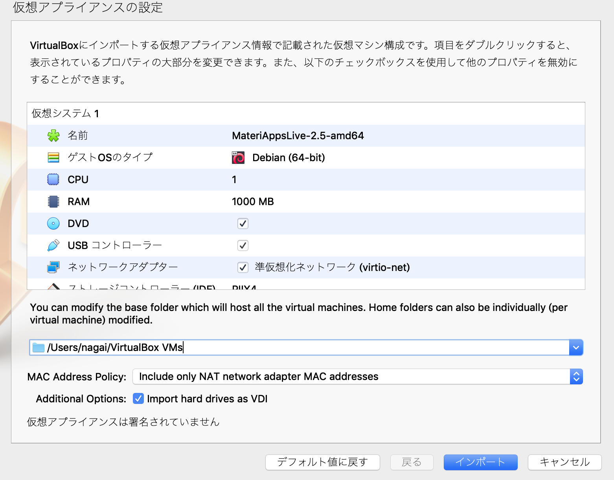

# MateriApps LIVE!のインストール
何らかのシミュレーションをするとき、最近は様々なフリーソフトウエアがあるおかげで、誰でも気軽に試すことができるようになってきました。
しかし、様々なフリーソフトウエアを試してみる時にまず最初の障害となるのが、そのソフトウエアのインストール作業です。インストールをするのに失敗して、結局投げ出してしまう、ということはよくあることだと思います。
例えば、第一原理計算ソフトウエアにはQuantum EspressoやABINIT、Open MXなど様々なフリーに使えるソフトウェアがあります。しかし、これらがどんな感じなのかを試そうとした時にそれぞれのインストールに四苦八苦して結局ソフトを試すことができない、ということはあるあるだと思います。
そんな時に便利なものがあります。それは、MateriApps LIVE!です。
https://cmsi.github.io/MateriAppsLive/
このサイトの説明には、

>MateriApps LIVE!は、手持ちのノートPCなどを用いて、気軽に計算物質科学アプリケーションを試せる環境を提供します。MateriAppsアプリケーション、OS (Debian GNU/Linux)、エディタ、可視化ツールなど、チュートリアルを始めるのに必要な環境は全て1本のUSBメモリに収められています。


とあります。
これはVirtualBoxという仮想PCソフトウエアのディスクイメージで、MacでもWindowsでもLinuxでも、VirtualBoxをインストールすれば、このディスクイメージを読むことができます。
VirtualBoxでは、Linuxが立ち上がります。
そのLinuxの中に、

>ABINIT, AkaiKKR, ALPS, CP2K, DCore, DDMRG, DSQSS, ERmod, feram, Gromacs, HPhi, LAMMPS, mVMC, OpenMX, Quantum ESPRESSO, RESPACK, SALMON, SMASH, TRIQS/CTHYB, TRIQS/DFT tools, xTAPP

が入っています。つまり、すでに有名なソフトウエアがインストール済みです。
ソフトウエアの詳細については
https://github.com/cmsi/MateriAppsLive/wiki/GettingStarted
こちらをみるとわかりやすいと思います。

## MateriApps LIVE!のダウンロードとVirtual Boxへの導入。
https://cmsi.github.io/MateriAppsLive/

から最新版をダウンロードします。具体的には、「Download LIVE! image」をクリックし、「Download Latest version」をクリックしてダウンロードしてください。
2.5GBくらいあります。

ダウンロードできたら、Virtual Boxに導入します。
Macの場合には、ダウンロードしたファイルをダブルクリックすれば導入できます。Windowsでも同様と思います。

 

ここで、RAMというのがメモリです。コンピュータの中にコンピュータを作ることになるので、ここでのRAMは実際のメモリ以上にすることはできません。
ここがなるべく多い方が快適です。4GBくらいあれば良いかと思います。
また、CPU、というのは仮想マシンで使うCPUコアの数ですので、4コアあるようなマシンであれば2コアくらい割り当てておくと快適でしょう。
これらはあとで変更することができます。

あとはそのままで「インポート」を押します。
これでVirtual Boxに導入されました


## 最初にすること
VirtualBoxのインストールと、ディスクイメージの起動まではできたとします。ディスクイメージはここでは64ビット版のamd64の方を使ったとします。

ユーザー名はuser、パスワードはlive
でログインすることができます。

デフォルトではキーボードが英語配列になっていますので、日本のキーボードを使っている方は、
左下のツバメみたいなアイコンをクリックして、System ToolsからLXTerminalを選んでターミナルを出し、

```sh
setxkbmap -layout jp
```
と入れれば日本語キーボード配列になります。
このままだと起動するたびに英語キーボード配列になるので、立ち上げたターミナルで

```sh
echo setxkbmap -layout jp >> .bashrc
```
と打って.bashrcに設定を書き込んでおきましょう。
あとは、Wikiを見るなり何なりで、色々試すことができます。